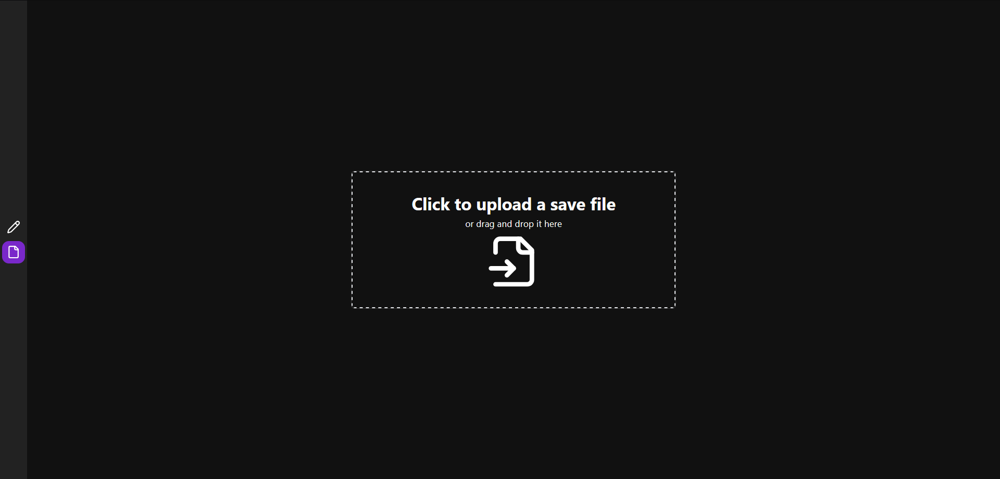
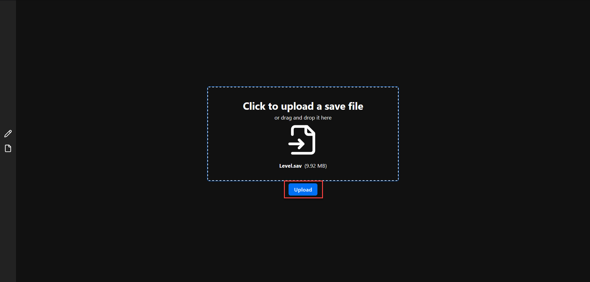
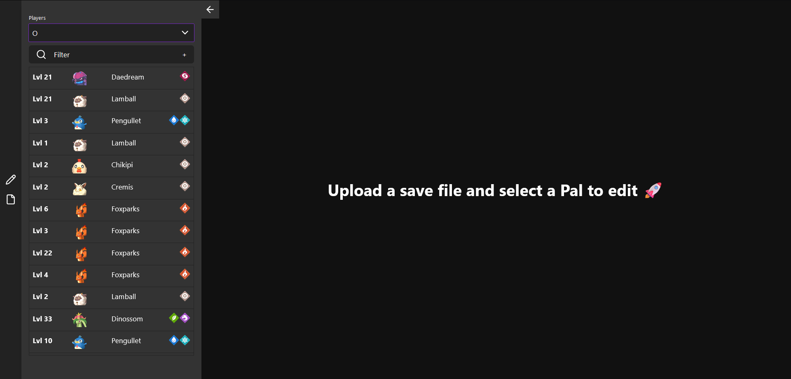
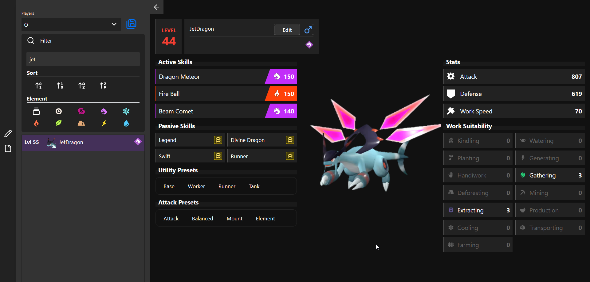
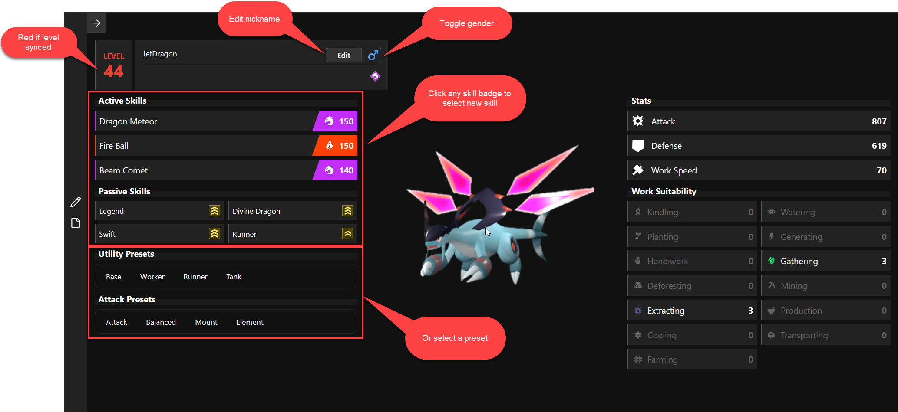
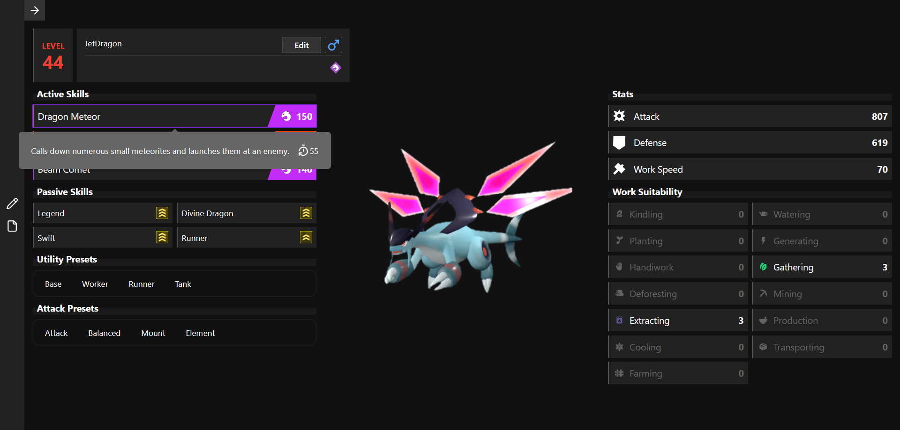
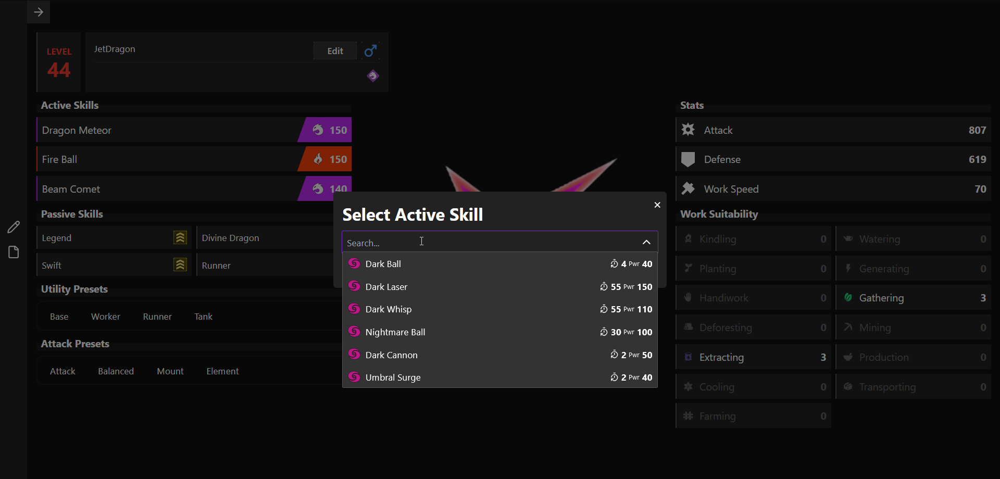
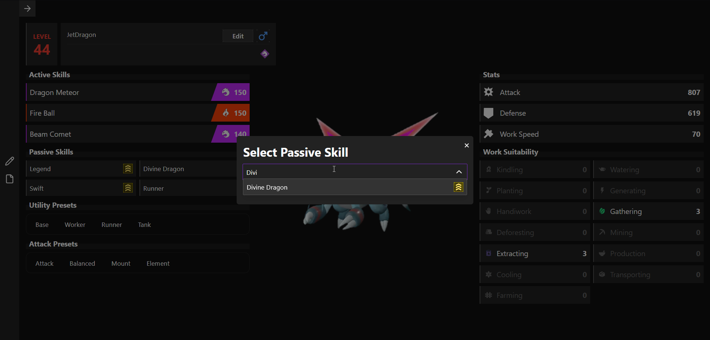
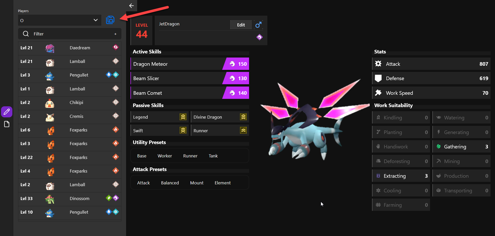
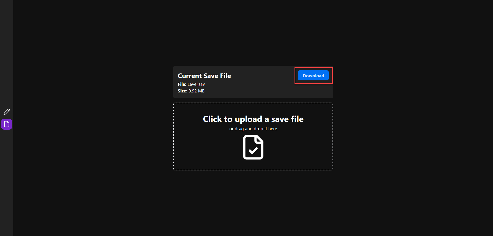

# PALWORLD Save Pal

> **Note**: This project was put together for fun and to kick the tires on Sveltekit 5 and Skeleton UI Next. Things may be broken or not work as expected. 

⚠️ **Backup your save files before using this tool!!** ⚠️

PALWorld Save Pal is a tool for managing and analyzing save files for the game PALWorld.

## 📋 Table of Contents

- [PALWORLD Save Pal](#palworld-save-pal)
  - [📋 Table of Contents](#-table-of-contents)
  - [🚀 Installation](#-installation)
  - [🎮 Usage](#-usage)
  - [🐳 Docker](#-docker)
  - [👨‍💻 Developer Guide](#-developer-guide)
    - [Web](#web)
    - [Build Desktop App](#build-desktop-app)
  - [🗺️ Roadmap](#️-roadmap)
    - [General](#general)
    - [Pals](#pals)
    - [Players](#players)
    - [Map](#map)
  - [📜 License](#-license)
  - [➡️ Related Projects](#️-related-projects)

## 🚀 Installation

Grab the latest release from the [Releases](https://github.com/oMaN-Rod/psp/releases) page and extract it to a folder of your choice.

## 🎮 Usage

To use PALWorld Save Pal, follow these steps:

1. Go the file page and add a file
   
2. Click the upload button
   
3. Select a player to see their pals, select any pal in the list
   
   *Alternatively you can use the filter to find a pal by name, nickname, or Element type*
   
4. Currently the available edit options are (more coming soon!):
   - Nickname
   - Gender
   - Active Skills
   - Passive Skills
   
   *You can hover over skill badges to see additional information*
   
5. Click on a skill badge to select/search for a new skill
   
   
6. Click the save button to save your changes
   
7. Head back to the file page and click the download button to download your updated save file
   

## 🐳 Docker

To run PALWorld Save Pal using Docker:

1. Clone this repository:

   ```bash
   git clone https://github.com/oMaN-Rod/psp.git
   ```

2. Run the build script based on your environment, these scripts capture the system IP address and set the environment variable for the svelte SPA:

   ```bash
   ./build-docker.sh
   ```

   ```powershell
   .\build-docker.ps1
   ```

3. Or you can follow these steps:
   1. Set the environment variable for the svelte SPA `ui/.env`. Replace `{{ ip_address }}` with the IP address of the server::

      ```jinja
      PUBLIC_WS_URL={{ ip_address }}:5174/ws
      ```

   2. Build the SPA (replace bun with your package manager of choice). This will create a build directory in the project root containing the static files for the SPA:

      ```bash
      cd ui
      rm -rf .svelte-kit
      bun install
      bun run build
      ```

   3. Build the docker image:

      ```bash
      docker-compose up --build -d
      ```

## 👨‍💻 Developer Guide

For developers who want to contribute to PALWorld Save Pal:

### Web

1. Set up the development environment:

   ```bash
   pip install -r requirements.txt
   ```

2. Run the application in development mode:

   ```bash
   python main.py --dev
   ```

3. Set the environment variable for the svelte SPA `ui/.env`.

   ```env
   PUBLIC_WS_URL=127.0.0.1:5174/ws
   ```

4. Run the frontend in development mode:

   ```bash
   cd ui
   bun install
   bun run dev
   ```

5. Open your browser and navigate to `http://127.0.0.1:5173`

### Build Desktop App

1. Set the environment variable for the svelte SPA `ui/.env`. Replace `{{ ip_address }}` with the IP address of the server:

   ```jinja
   PUBLIC_WS_URL={{ ip_address }}:5174/ws
   ```

2. Build the SPA (replace bun with your package manager of choice). This will create a build directory in the project root containing the static files for the SPA:

   ```bash
   cd ui
   rm -rf .svelte-kit
   bun run build
   ```

3. Create EXE:

   ```bash
   pyinstaller --onefile --windowed desktop.py
   ```

4. Copy build to the dist folder:

   ```bash
   cp -r build/* dist/
   ```

   *Powershell*

   ```powershell
   cp -R .\build\ .\dist\
   ```

> **Note:** The `dist` folder will contain the executable and the SPA build files and needs to be distributed together.

## 🗺️ Roadmap

Here's what's planned for future releases of PALWorld Save Pal:

### General

- [X] Filter Pals by name, nickname, or Element type
- [ ] Remote access to save files (sftp to remote server)
- [ ] Bulk edit pals (e.g., set all stomachs to 100%)
- [ ] Profile system to save/load presets for pals and players
- [ ] Proper localization support

### Pals

- [X] Edit Nickname
- [X] Edit Gender
- [X] Edit Active Skills
- [X] Edit Passive Skills
- [ ] Edit Health
- [ ] Edit Stomach
- [ ] Edit Level
- [ ] Edit learned skills
- [ ] Edit Rank
- [ ] Edit Souls
- [ ] Set/Unset Lucky
- [ ] Set/Unset Boss
- [ ] Change Pal species
- [ ] Add/Remove Pals
- [ ] Clone Pals
- [ ] Pal profiles creating presets for level, gender, and skills

### Players

- [ ] Edit Player Name
- [ ] Edit Player Level
- [ ] Edit Player Money
- [ ] Edit Player Inventory
- [ ] Add/Remove Players
- [ ] Player profiles creating presets for level, money, and inventory

### Map

- [ ] Edit Storage items

## 📜 License

MIT License (do whatever you want with it).

## ➡️ Related Projects

These are projects I've found that specifically target PALWorld save files, each was helpful in some way during the development of this project:

- [PalEdit](https://github.com/EternalWraith/PalEdit) - PSP was inspired by it. The goal is to reach feature parity with this project, in the mean time if you're looking for a more feature-rich tool, check it out!
- [palworld-save-tools](https://github.com/cheahjs/palworld-save-tools) - PSP uses this tool for handling save files, can be used directly to convert to/from json.
- [palworld-uesave-rs](https://github.com/DKingAlpha/palworld-uesave-rs) - I originally considered building this app using Tauri, opted for using Python, but this project was helpful.
